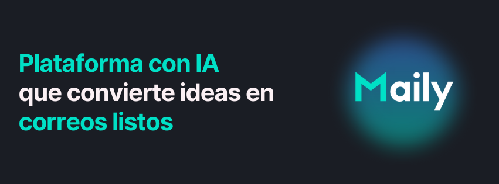
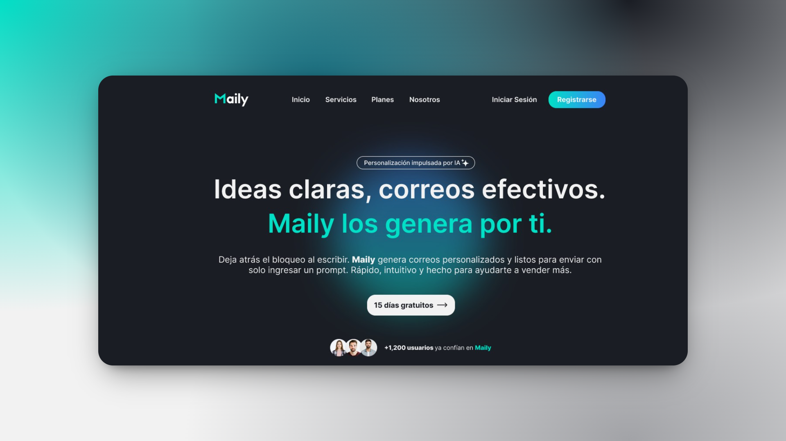
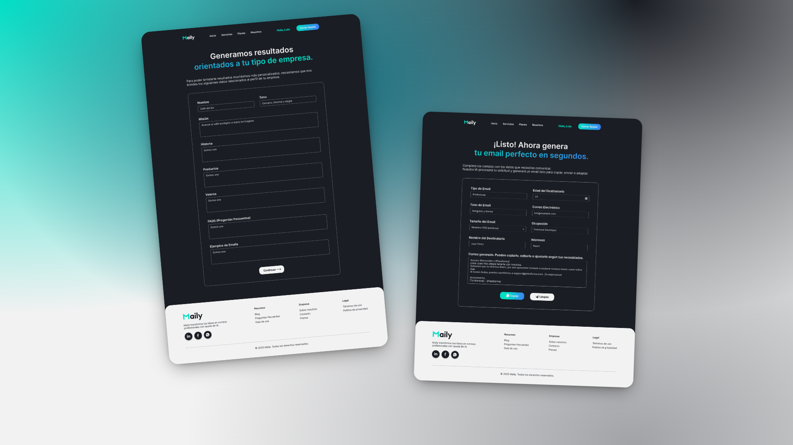

  

# ✉️ Maily | AI-Powered Email Generator – Team 12 | Proyectos Express

**Ideas claras, correos efectivos.**  
**Maily los genera por ti.**

**Maily** es una herramienta impulsada por inteligencia artificial que transforma ideas en correos listos para enviar. Está diseñada para ayudar a emprendedores y PyMEs a optimizar su comunicación de marketing outbound sin esfuerzo. Solo ingresa tu prompt, selecciona el tipo de email, tono y longitud, ¡y Maily se encarga del resto!

---

## 🎯 Propósito del Proyecto

Crear un MVP funcional que automatice y personalice la redacción de correos electrónicos usando IA con integración RAG. Su objetivo es mejorar la efectividad del marketing outbound y reducir el tiempo invertido en la redacción de mensajes.

---

## ❗ Problemática y Solución

- **Problema:** Las PyMEs suelen tener dificultades para crear correos efectivos, rápidos y personalizados que conecten con sus clientes.
- **Solución:** Maily automatiza el proceso de redacción, generando correos persuasivos y personalizados en segundos, con base en un sistema inteligente y adaptable.

---

## ✨ Funcionalidades Principales

- 📬 **Generación Inteligente de Correos**  
  Redacta emails en tiempo récord completando unos simples campos. Maily adapta el contenido según:
  - Tipo de email: comercial, informativo, de bienvenida, etc.
  - Tono de comunicación: formal, casual, empático, directo.
  - Longitud del mensaje: breve o extenso.
  - Objetivo del mensaje: vender, informar, conectar.

- 🎯 **Personalización Total**  
  Ajusta cada mensaje a tu marca o propósito específico. Obtén textos coherentes con tu estilo comunicacional.

- ⚡ **Resultados Inmediatos y Listos para Usar**  
  Copia, edita o transfiere el correo generado a tu herramienta favorita. Ahorra tiempo y mejora tu marketing.

---

## 🔁 Flujo del Usuario

1. Completa los campos de tipo de email, tono, longitud, mensaje, etc.
2. Haz clic en generar.
3. Visualiza el correo redactado.
4. Copia o edítalo al instante.

---

## 🎨 Diseño UX/UI

  

---

## 🧠 Tecnologías Utilizadas

### 🎨 UX/UI Design

### 🖥️ Frontend

### ⚙️ Backend

### 🛠️ Herramientas

---

## 🛠 Proyecto en No Country | Proyectos Express

Este MVP fue desarrollado en tan solo 5 días, bajo una metodología ágil, multidisciplinaria y con alcance iterativo. Cada jornada del proyecto estuvo enfocada en una etapa clave del ciclo de vida del producto, desde la ideación hasta el deploy.

---

## 🤝 Nuestro Equipo

<table align="center">
  <tr>
    <td align="center">Luis Angel </td>
    <td align="center">Felipe Hernández </td>
    <td align="center">Facundo Castro </td>
    <td align="center">Danny Mejía </td>
  </tr>
  <tr>
    <td align="center">Frontend Developer & UX/UI</td>
    <td align="center">Frontend Developer</td>
    <td align="center">Backend Developer</td>
    <td align="center">Backend Developer</td>
  </tr>
  <tr>
    <td align="center">
      
    </td>
    <td align="center">
      
    </td>
    <td align="center">
      
    </td>
    <td align="center">
      
    </td>
  </tr>
</table>

---

## 🔗 Enlaces del Proyecto

  

---

## 🧩 Nuestra Visión

> "Un email puede abrir puertas. Nosotros te ayudamos a que lo escribas mejor."

Maily nace para transformar la manera en que las PyMEs se comunican. Apostamos por la tecnología útil, el diseño centrado en el usuario y la innovación que soluciona problemas reales. Nuestro enfoque es claro: facilitar el proceso de redacción y potenciar resultados.

---

## 💬 Testimonios del Proyecto

> “Redactar nunca fue tan fácil... ni tan efectivo.”  
> Con Maily, transformar ideas en correos profesionales es tan simple como llenar un formulario.

---

## 📄 Licencia

Este proyecto fue desarrollado con fines demostrativos y educativos como parte del programa **Proyectos Express** organizado por **No Country**.

---
